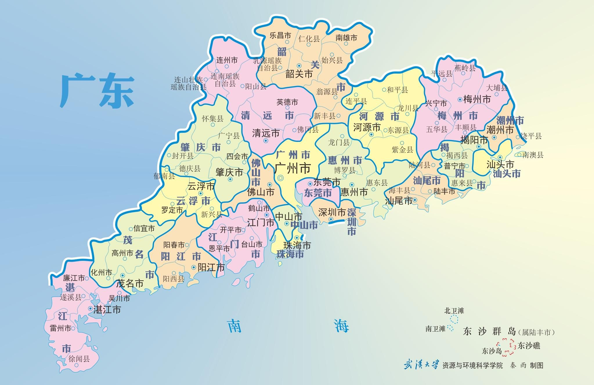
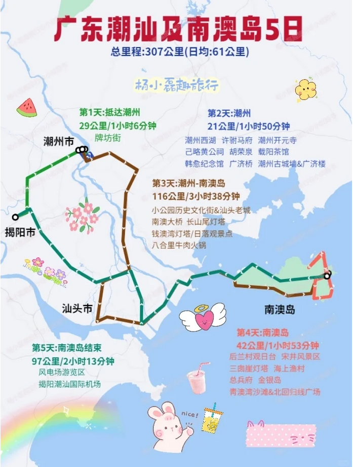

### 广东美食

食在广东，味在潮汕

肠粉、白切鸡、煲仔饭、叉烧包、虾饺、蚝烙、干蒸烧卖、奶黄流沙包、酥皮菠萝包、马蹄糕、马拉糕、粟米饼、鲜虾红米肠、天鹅酥、豉汁蒸凤爪、酱汁金钱肚、糯米鸡、蛋挞、陈皮牛肉丸

### 潮州

#### 景点

##### 潮州古城

##### 广济桥

又称“潮州湘子桥”，中国四大古桥之一。

##### 镇海楼

##### 牌坊街

全国独一无二的文化景观及吃货天堂

##### 颐园

隐藏在牌坊街内的小众打卡点

##### 潮州西湖

散散步吹吹风，附近有20+年老字号芝麻茶 [谢怀亮] 就在西湖公园北门对面，建议双拼茶(芝麻+杏仁)

##### 涵碧楼

在西湖公园里面，有时间可以参观参观

##### 北阁佛灯

楼阁不大，但是往上走会发现不一样的潮州

##### 甲第巷

保留着潮州的古色古香，感受古时民居风貌

##### 泰佛殿

潮州版泰兰德，不大，可以进去感受异域风情

##### 淡浮院

风景很不错，适合在这里喝喝茶

##### 凤凰天池

看日出看云海的绝佳打卡地

##### 凤凰洲公园

推荐 2-4 月来，春季赏花踏青好去处

##### 龙湖古寨

在这里感受古城村落原住民的生活

##### 许驸马府

宋代古民居，基本保持着北宋风貌深宅大院

##### 

#### 美食

##### 载阳茶馆（牌坊街店）

##### 沙溪海记牛肉

离潮汕站5分钟路程

##### 溪口刘卜鹅肉

50年三代传承老字号卤鹅，常年要排队，但是真的这口咸甜口味的卤鹅深得我心

##### 圆蛋酒料

下午三四点才营业，每日现做的生腌、熟食，腌膏蟹、腌生蚝、有籽鱿鱼饭、海蜇。店门口还有“潮州府城”四字红色墙体，可以打卡拍大片

##### 厝角头甜品

门口也有 潮州 二字打卡字样，老式鸭母捻杂杂，椰奶海石花杂杂，老式番薯芋头

##### 阿荣砂锅粥

潮州砂锅天花板，必打卡，虾蟹粥的鲜甜吃过才知道！香煎扒鱼皮，爆炒田鸡

##### 忆湘子鲜烤肉脯

牌坊街卖特产的店

### 汕头

#### 景点

##### 汕头小公园

保留了20世纪30年代汕头市街区面貌，见证和承载了汕头“百载商埠”的历史

##### 老妈宫戏台

汕头开埠前最早的建筑，中西合璧的建筑风格，有各类的演出活动

##### 存心公馆

汕头百年历史建筑，巴洛克风格超精美！斜对面有家本地人最爱的饮品：长平何记果汁冰，是一对夫妻开的，水果现点现切用料很足，他们家的芒果卡士、黄皮汁、石榴+桃子果汁冰都很好喝

##### 汕头旅社

标志性的“汕头”两个大字，适合拍照打卡，附近有家本土功夫茶饮：参顺顺花茶，可以坐着喝茶感受汕头人民的慢生活，那个红花钥匙扣周边也很潮汕。

##### 潮汕铁路旧址

中国历史上第一条商办铁路，复古好拍照

##### 西堤公园

在老市区，是个看日落的好地方

##### 广场轮渡

2块钱的快乐是轮渡给的，体验一下在轮渡上看海的氛围感

##### 妈屿岛

一座日系小岛，很好的拍日系写真，岛上有个小沙滩，还有一个海边书店，也很好出片

##### 东海岸

离市中心不远的一个海边，这边可以看日出也可以看日落

##### 北沙滩

在濠江区的一个海边，这边也可以看日出

##### 中山公园

汕头现存历史最久的公园

##### 海滨长廊

近2km的带状公园，沿海而造

##### 南澳岛

后兰村观日台➞宋井风景区➞三囱崖灯塔➞海上渔村（深澳湾）➞总兵府➞金银岛➞青澳湾沙滩&北回归线广场

1.后兰村观日台:整个南澳岛的制高点，即使东边的山也挡不住观日出的视线。只要晴天，一定可以看到太阳从海平面冉冉升起
2.宋井风景区:南宋时期为南宋少帝以及兵马挖掘的水井，适合特别喜欢历史的朋友
3.三囱崖灯塔:南澳岛金交椅三囱崖灯塔 ，是南澳岛网红拍照圣地
4.海上渔村（深澳湾）:很多鱼排和渔家乐，可以吃海鲜，体验海钓
5.总兵府:20分钟逛完的小景点，但却是全中国唯一的海岛总兵府，如对历史感兴趣，值得一去
6.金银岛:一处三面环海，碧波荡漾的半岛，传说是海盗吴平藏宝的地方
7.青澳湾沙滩&北回归线广场:岛上最好的海湾，可以看日出，也有风光宜人的海滨浴场

保济丸

##### 长山尾灯塔（起航广场/南澳大桥拍摄点）

##### 钱澳湾灯塔/日落观景点

##### 

#### 美食

##### 粿然 李记粿汁(万象城店)

汕头老字号的粿汁店，粿汁也是潮汕传统民间小吃之一，来汕头当然要来一碗！米香浓郁的粿角淋上卤汁，再加点“卤猪肠”“卤肉”“苦瓜”等！真的太香了

##### 阿赤牛肉丸 潮汕牛肉火锅

来汕头吃牛肉真的没必要去排网红店！这家真的好多本地人都来吃！它家的牛肉丸跟拳头一样大！Q弹多汁太顶了！牛肉也是出了名的新鲜，肉太嫩了！

##### 三姐妹肠粉

一家开在老市区的肠粉店，店铺环境一般但是肠粉真的没得说！除了肠粉还有蒸面蒸米粉等等

##### 瑞娇嫲嫲生腌

来汕头必吃的生腌！它家也有很多明星来打过卡！冰淇淋口感的生腌真的上头！不过肠胃不好的朋友建议少吃！可以配上粥吃！

##### 潮堂枝上 老味新派潮汕菜

来汕头当然要吃潮汕菜啦！它家的菜品选择很多，安利它家的“爆炒大腰花”“普宁炸豆干”“潮式手撕鸡”“沙茶炒牛肉”等等！

##### 广场老牌豆花

一家本地人从小吃到大的老店，它家都是潮汕特色甜汤和小吃！超爱它家的豆花

##### 有茶古

开在老市区的一家茶饮店，它家的柠檬茶很潮汕，我喜欢它家的鸭屎香系列，还有三明治，而且它的三明治竟然还有夹牛肉丸、鱼丸的！

##### 喜当椰清迈小牌档

它家的泰料真的很正宗，我最喜欢开胃的冬阴功汤和下饭的咖喱皇年糕虾

##### 居石捞海鲜大排档

一家把海鲜火锅、卤水、日料等等集合在一起的宝藏餐厅！我们点了个鸳鸯锅，一边是下了卤水汤底，一边花椒鸡浓汤底的。它家的奶油虾和避风塘炒膏蟹强烈安利，太新鲜了

##### 阿帕茶肆

一家带有包间的潮式茶馆

##### 李小姐的店 潮汕特产

它家开在市场旁边，一看店面就知道是靠谱老店！

##### 龙眼美食街

##### 林小柔绿豆沙牛乳

纯手工鲜煮熬，选用鲜牛乳，无香精奶精植脂末，绿豆沙牛乳，红豆沙豆乳，黑芝麻拿铁，香珉冬瓜茶

##### 潮禧记炸鸡翅

潮式鸡翅，大只！

##### 傻脑蚝烙

上过央视的传统名小吃，这家店只推荐蚝烙，其他的不行

##### 东市白粥

晚上才营业，但是也是分分钟要排长龙，物美价廉

##### 金新肠粉

##### 长平何记果汁冰

#### 备注

1. 汕头看海要看天气预报
2. 市内骑共享单车就行，不然容易碰上塞车
3. 轮渡要错峰，可以看日落
4. 牛肉要去大众看一些比较久的老店
5. 无论什么店买之前要先问价格
6. 汕头展馆大部分周一闭馆
7. 汕头生腌要少吃
8. 汕头好吃的比较多，要备一些肠胃药

### 揭阳

#### 景点

##### 进贤门城楼

揭阳当地最具历史感的标志性建筑，处于交通要塞，傍晚亮灯后更好看！

##### 揭阳学宫

揭阳学宫是岭南地区规模最大、保存最完整的孔庙，面积仅次于山东曲阜孔庙，主要建筑有照壁、棂星门、泮桥、泮池、大成门、大成殿、崇圣祠等。

##### 关帝庙

关帝庙是揭阳古建筑中最值得看的，拥有华丽繁缛的潮汕木雕和剪瓷脊饰，正殿顶为九脊重檐悬山顶，工艺精美，前厅顶上之八卦形藻井，是揭阳现存唯一庙宇藻井。

##### 中山路骑楼老街

与汕头小公园和潮州牌坊街相比，揭阳的中山路骑楼街更显得破旧，依旧是八九十年代时的样貌，也因为如此，被称为潮汕地区保存最完好的骑楼老街。

##### 城隍庙

广东地区最大的城隍庙，常年香火旺盛，位于中山路骑楼街旁，可以顺道游览，如果你有时间，不妨走进去看看！

#### 美食

##### 后坡巷口反沙咸蛋黄

店面位于巷子口，很小的店，反沙咸蛋黄是新鲜出炉的，特别好吃，还可以购买一些包装好的小零嘴，带回家吃。  反沙咸蛋黄、反沙香芋条、反沙红薯条

##### 阿喜面店

店面不大，位于一个停车场的后面，餐食选择不多，酸甜面或咸的干拌面，都会配汤，叉烧、腊肠、猪肚等等食材可以任吃，一碗面才12元，真的是物美价廉了。

酸甜面、干拌面

##### 进安街大排档

非常多人推荐的一家大排档，位于进安街，很具有烟火气息的大排档，食材全部摆在门口任选，看着很开胃，海鲜选择也非常丰富，可以点小炒，搭配潮汕最经典的白粥、鱼饭，yyds！

白粥、鱼饭、生腌、普宁炸豆腐、炸大虾

### 汕尾

#### 景点

##### 金町湾

沙滩由于属于外海，浪大所以不建议游泳，可以在边边踏浪玩沙，还有很多海上游玩项目

风帆礼堂、鲸湾小镇、山海剧院

##### 红海湾海上城堡(烂尾楼)

被誉为“海上孤岛”的网红打卡胜地，犹如哈利波特阿兹卡班 欧式建筑风，废弃的城堡拍照分分钟大片 南海观音、海上古堡、遮浪沙滩、灯塔岛、海边路

##### 风车岛

风车岛和海上公路就是同个景点，无需分为2个景点，汕尾最美海景公路，全天24小时开放，两边都是海，不远处就能看到风车

##### 天空之城

“汕尾小洱海” 拍照胜地

##### 龟龄岛

形状酷似乌龟，坐拥 360 无敌海景的神仙岛屿

##### 白鹤寺

距离金町湾最近的赶海点

##### 中国蚝乡辰州村

吃生蚝的胜地，如果只是单纯观光游览就不太建议

##### 江牧岛

拥有彩色的贝壳沙滩，贬低都是贝壳，推荐指数不是很高

##### 铜鼎山景区

汕尾市民的后花园

##### 马宫镇

牛尾山、马宫港、摄影基地

##### 莲花山

粤东沿海第一高峰，鸡鸣寺、玉蟾宫、仙人洞、莲花山温泉

##### 赤石镇水底山温泉

##### 金厢银滩

彩色小镇，沿海自驾公路

##### 玄武国

国家4A 香火鼎盛，元山寺、福星塔、南门牌坊

##### 浅澳沙滩

古炮台遗址、林则徐题匾、全国离海岸线最近的妈祖庙天后宫

##### 华发清泉谷

热带风情温泉度假村

##### 白水寨瀑布

#### 美食

##### 二马路美食

薄饼、牛腩火锅、海鲜粥、糖水、夜市

##### 各种大排档

##### 甜品饮品

刨冰、鲜榨果汁、咖啡

##### 薄冰

##### 牛肉饼

##### 牛腩火锅

##### 源记菜粿

##### 德记牛腩

##### 大街菜茶

##### 德明菜粿

##### 灰窑海鲜粥

##### 明叔捞面

##### 雄浩麻鱼粿

##### 邓记火锅

##### 宝木肠粉

##### 汕中薄饼

##### 林舜杰薄冰

##### 油柑鸟梨

#### 住宿

##### 汕尾金町湾或城区

金町湾开发比较完善，选择多

### 惠州

#### 景点

##### 中山状元坊

##### 双月湾

三面环海，因形状鸟瞰似两轮新月，海沙洁白晶莹，海水清澈蔚蓝，晚上可以住宿在双月湾，工作日靠海的酒店才 200

##### 大澳村沙滩

这是一片人少的玻璃海，早上树木挡住太阳，不用暴晒玩水还能看玻璃海

##### 海归湾

大澳村旁边一公里，门票30，一半山一半海，拍的每一张图都绝美

##### 三角洲岛

一个像马尔代夫的私人海岛，晴天才去，不用预约，现场很多拉客的，人均 60-100来回，然后返回到磨子石公园，岩石配上日落简直是大片

##### 狮子岛

##### 一滴水图书馆

##### 情人堤

##### 双月湾全景观景台

##### 巽寮湾十里银滩

##### 小径湾乌头山绿道

##### 九铭屿海

##### 磨子石公园

##### 三角洲岛

##### 三角玫瑰教堂

##### 黑排角

##### 情人岛

##### 礁石酒吧

##### 赶海捕鱼

##### 惠州西湖

##### 合江楼

##### 水东街

#### 美食

##### 潮汕油柑橄榄汁

『水东街-杨铛铛』刮油解腻鲜榨减肥降火一举多得

##### 中国馒头

『野岛-中国馒头』野岛路上偶遇的小店新中式风格，做中国人的面包主打🔸低糖低卡🔸妈妈很喜欢

##### 惠康汤粉

野岛直走三百米的小巷里🔥必吃🔥没吃等于白来惠州⚠️ 主打惠州特色横沥汤粉
卤水任夹 鸭肾鸭翅入味

##### 小巷食

客家菜口味，也是本地人会吃的老字号，祝屋巷那边，我觉得比黎记舒适有空调，出品稳定，酸菜炒牛肉很绝，酸辣可口爱惨了

#### 备注

1. 某团上过于便宜的海鲜套餐，要么是分量极少，要么是不新鲜，价格适中的可以购买
2. 提前备好整肠丸，避免海鲜过敏和肠道不适
3. 遇到路边卖海菠萝的不要买，难吃又贵
4. 双月湾的大亚湾能看得到日落，而虹海湾能看得到日出，别搞反了
5. 号称东方巴厘岛的礁石就把火爆全网，也是国内唯一的礁石酒吧，必定要打卡，在 GZH 园方东山海 可以预定，没有所谓的快速通道
6. 号称广东小垦丁的海龟湾有一条主线路和副线路，想快速抵达海边栈道和海龟馆的走主线路
7. 海龟湾最漂亮的风景在海边栈道会仙桥

### 深圳

#### 景点

##### 世界之窗

门票 220

##### 小梅沙

##### 桔钓沙

##### 梧桐山

##### 深圳海上世界

##### 赛格广场

##### 中英街

##### 大梅沙海滨旅游区

##### 地王大厦

##### 华强北

##### 东门老街

##### 滨海栈道

##### 欢乐港湾

#### 美食

##### 杀猪粉（至尊杀猪粉）

来深圳必吃的一个粉

##### 菠萝海石花（何记三饶饺）

##### 招牌奶提（813芭依珊）

24小时持续供应的奶茶，年轻人超爱

##### 九村烤脑花

深圳终于也开了！！在重庆吃过一次就念念不忘，嫩滑香辣的烤脑花一口爱住，各种烤串更是香迷糊了

##### 木货街老火锅

吃火锅还得是他们家！汤底醇香浓郁，越煮越香，耙牛肉吃起来贼过瘾，口感很嫩，值得N刷~

##### 佳俊八宝牛杂

牛杂种类还挺丰富的，而且处理得很好，汤底十分鲜美，吸满汤汁的白萝卜也巨好吃

##### 电白鸭粥店

开了很多年的老店，店内大多数都是附近的居民，白切系列的都可以闭眼冲，食材很新鲜

##### 菜忠潮州牛肉店

湿炒牛河必点！份量真的很足，而且牛肉给的也超多，每一口都是大大的满足

##### 荔芳传统糖水铺

味道很正的广式糖水铺，糖水种类非常的丰富，双皮奶无比嫩滑，入口即化~

### 东莞

#### 景点

##### 林则徐硝烟旧址

旧厂房改造成的文创园

##### 可园博物馆

适合拍摄古风照片

##### 振华路

标志性的骑楼，梦回90年代

##### 鳒鱼洲+工农8号

##### 华为小镇

骑行、露营、拍照好去处

##### 下呗坊

喜欢一边听着驻唱歌喝着小酒的不能错过了

##### 塘尾古村落

体验宋代的古村落

##### 粤晖园

古典私家园林

##### 滨海湾

东莞看海最佳地

### 广州

#### 景点

##### 越秀公园

又称越秀山，越秀山又有“广州小氧吧”的美誉

##### 海心沙亚运公园

##### 海心桥

##### 北京路步行街永庆坊

##### 荔枝湾

##### 船游珠江

##### 圣心大教堂

##### 上下九步行街

##### 广州塔

广州塔又称小蛮腰，塔身主体450米，总高度600米

##### 永庆坊

打卡岭南老旧骑楼和西关大屋，看月亮桥，和众多集市、文创小店、园林酒家和广州老字号

### 佛山

#### 景点

##### 佛山祖庙

祖庙整座建筑多用木石材料， 斗拱梁架全用坚实的木料接榫构成，文物众多

##### 大良钟楼

##### 金榜上街

##### 清晖园

##### 顺峰大牌坊

##### 顺德华侨城欢乐海岸

##### 岭南天地

##### 民信老铺

### 阳江

#### 景点

##### 海陵岛

大海的悬崖栈道： 沿着海边悬崖而建的栈道，一边是悬崖，一边是大海，看惊涛骇浪拍打岩石，十分壮观

悬崖无边泳池：建在马尾岛山顶悬崖边的泳池，俯瞰无边大海，Tiffany蓝的池水超美

粉色螺旋梯观景台：少女心满满，特别童话，登高眺望，大海、岛屿、灯塔、栈道尽收眼底

椰林沙滩：从栈道下来就是沙滩，沙质滑细干净，椰林树影特别有东南亚海岛风情，还有海边夜市，度假感满满，但是如果想到海里游泳则需要另外租救生衣才可以

### 参考资料

- https://www.xiaohongshu.com/explore/6468770b000000001203d225
- https://www.xiaohongshu.com/explore/6508049c000000001e02841b
- https://www.xiaohongshu.com/explore/6523b1d1000000001f039346
- https://www.xiaohongshu.com/explore/651f6217000000001e02eed9
- https://www.xiaohongshu.com/explore/65051a6f000000001e02cc67
- https://www.xiaohongshu.com/explore/64bcf732000000000c03762a
- https://www.xiaohongshu.com/explore/652a36b7000000001e00ead7
- https://www.xiaohongshu.com/explore/64fad391000000001e033312
- https://www.xiaohongshu.com/explore/64cb3ad2000000000103f637
- https://www.xiaohongshu.com/explore/6509824e000000001f0042c8
- https://www.xiaohongshu.com/explore/6442206a0000000013031cc4
- https://www.xiaohongshu.com/explore/651c1ada000000001f035895
- https://www.xiaohongshu.com/explore/6525344d000000001e0211fb
- https://www.xiaohongshu.com/explore/651ff372000000001e028354
- https://www.xiaohongshu.com/explore/65114e64000000001f0055c8
- https://www.xiaohongshu.com/explore/65266b3d000000001e021f21
- https://www.xiaohongshu.com/explore/6513dd5c000000002101fea4
- https://www.xiaohongshu.com/explore/651145d8000000001d01780d
- 揭阳：https://www.xiaohongshu.com/explore/650ef6f2000000001e02de64
- 揭阳：https://www.xiaohongshu.com/explore/6510c92c00000000140241db
- 揭阳：https://www.xiaohongshu.com/explore/652a7909000000001e032a0b